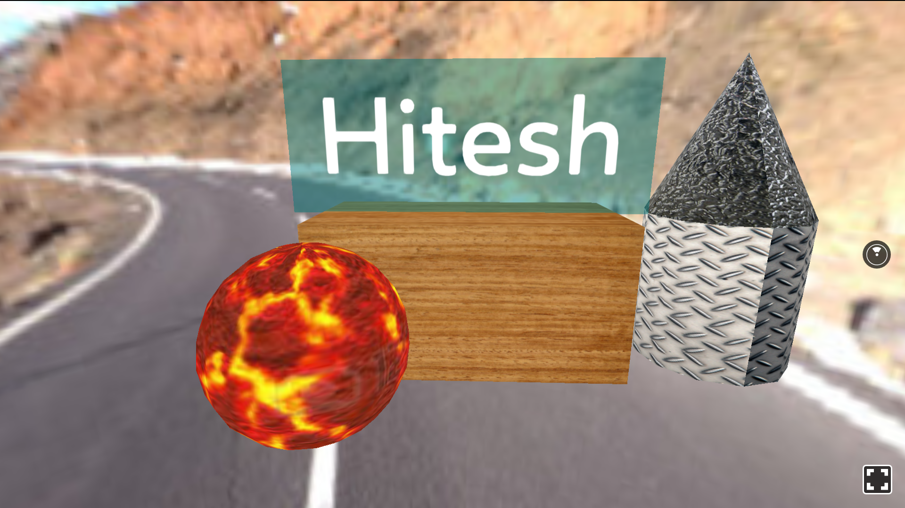

# React Virtual Reality Sample

    

### NPM commands

- Install the React VR CLI tool

    `npm install -g react-vr-cli`
  
- Create React VR Project

    `react-vr init WelcomeToVR`
   
-  Run ReactVR project on http://localhost:8081/vr/index.html

    `npm start`
    
 -  Run on Android Device
 
   `adb reverse tcp:8081 tcp:8081` OR http://localhost:8081/vr/index.html OR http://IP_Address_of_Host:8081/vr/index.html.

### Legal

     Copyright 2017 Hitesh Sahu (http://hiteshsahu.com)

       Licensed under the Apache License, Version 2.0 (the "License");
       you may not use this file except in compliance with the License.
       You may obtain a copy of the License at

           http://www.apache.org/licenses/LICENSE-2.0

       Unless required by applicable law or agreed to in writing, software
       distributed under the License is distributed on an "AS IS" BASIS,
       WITHOUT WARRANTIES OR CONDITIONS OF ANY KIND, either express or implied.
       See the License for the specific language governing permissions and
       limitations under the License.

